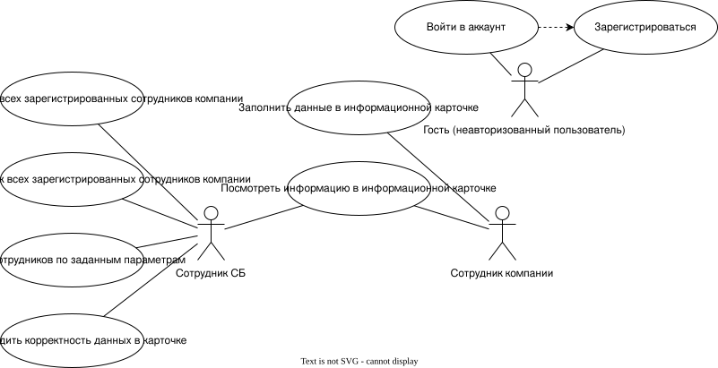
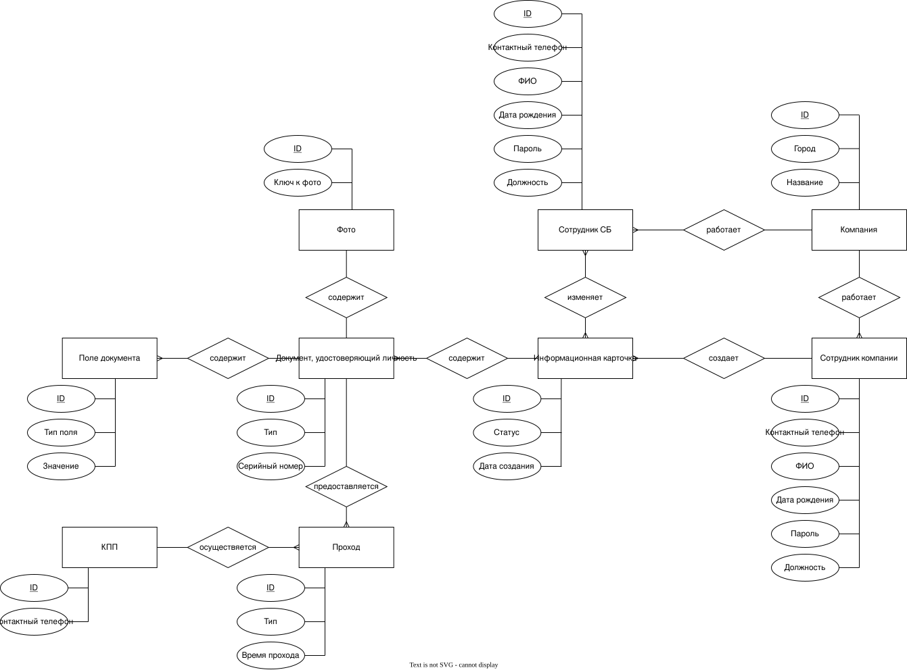
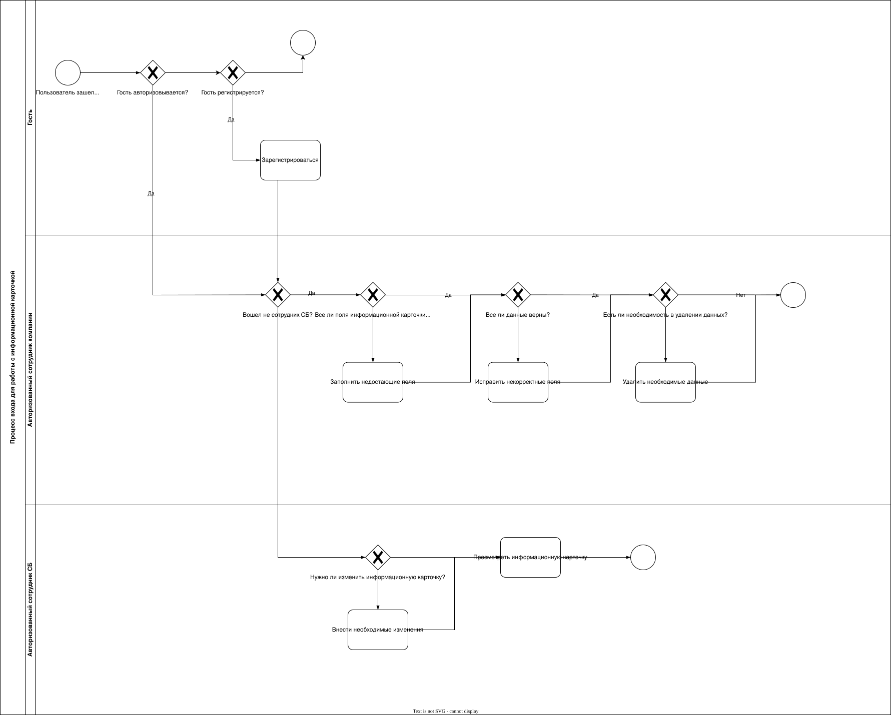
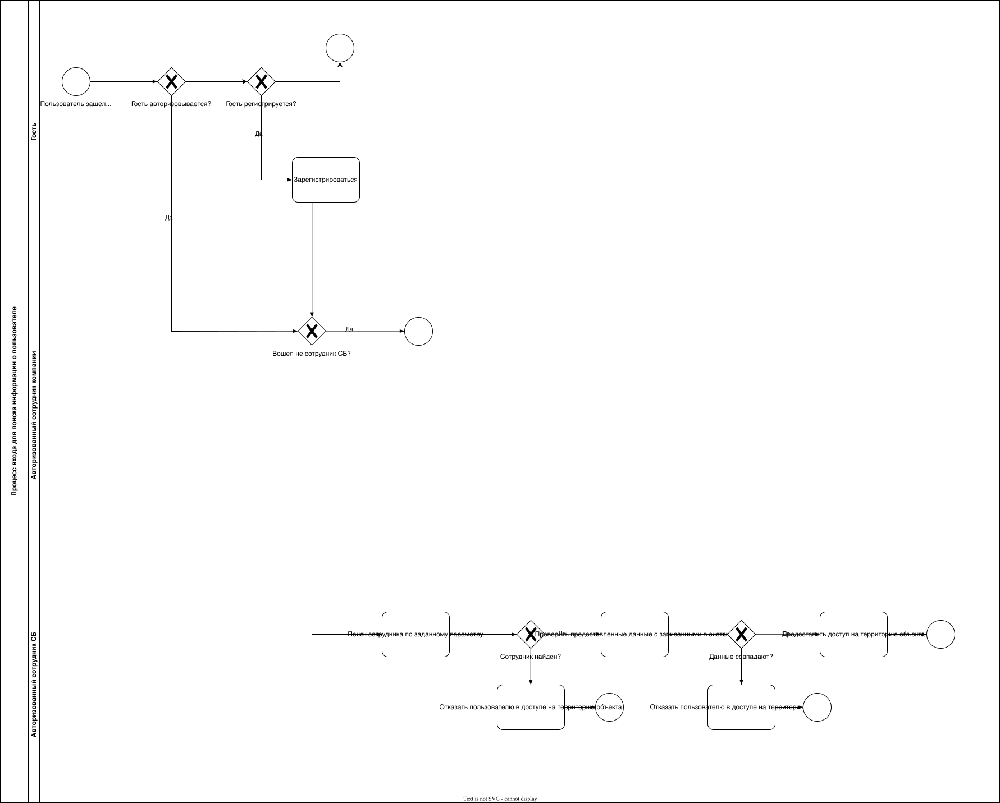
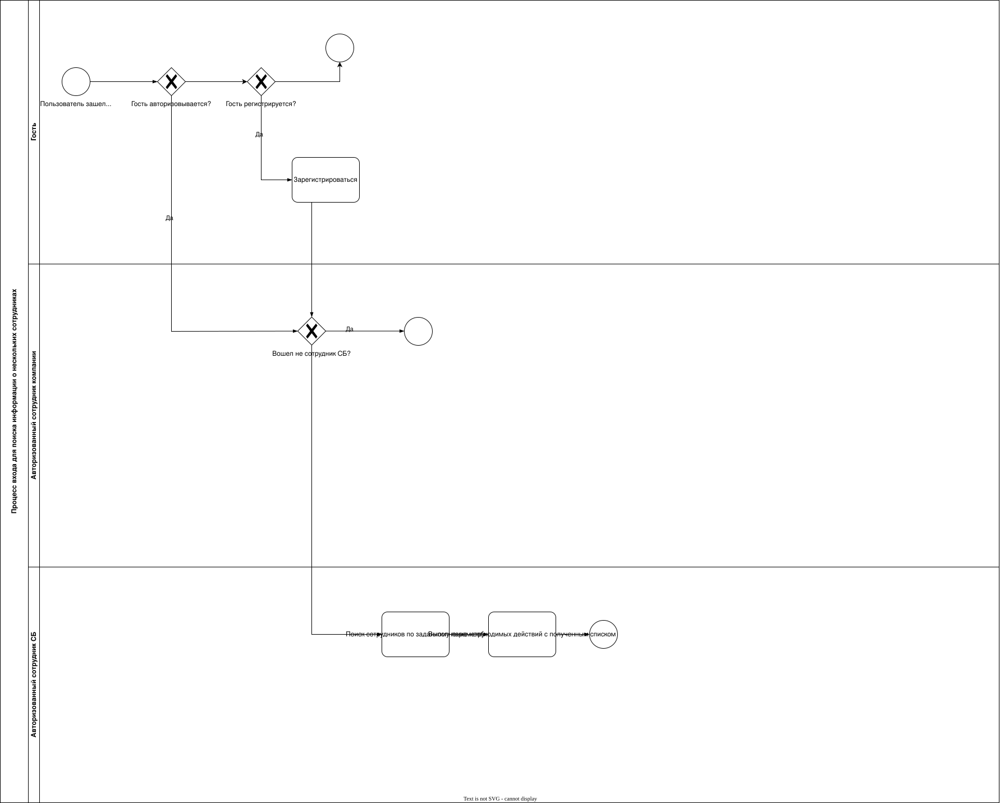
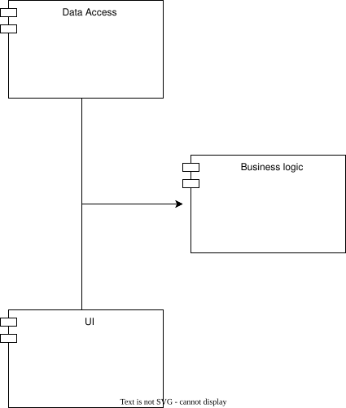
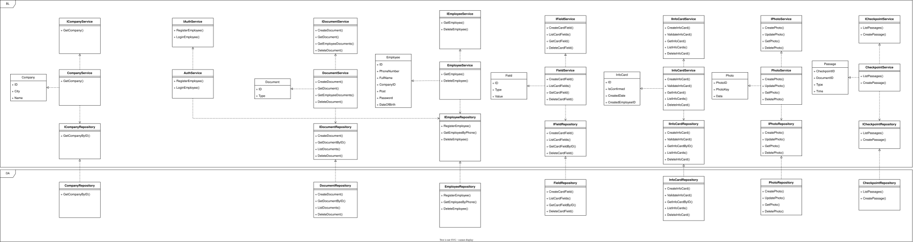

# Checkpoint service

A system for identifying employees at a company checkpoint. A security officer has to
answer one question quickly, whether the person standing in front of them may pass, and
that requires the identity document, the employee card and a search that works by any of
their fields.

## Existing solutions

| Solution | Search by arbitrary attributes | Stores the identity document | Self-registration |
|----------|:---:|:---:|:---:|
| [ИНФОСТАРТ](https://infostart.ru) | no | no | yes |
| [PASS24.online](https://pass24online.ru) | no | no | yes |
| [Малленом Системс](https://www.mallenom.ru) | no | yes | no |
| This project | yes | yes | yes |

## Roles and scenarios

A guest is an unauthenticated visitor, an employee is a registered user who owns an
information card, and a security officer is the employee responsible for the checkpoint.

An employee opens the site, signs up and lands on their own card to fill in. A security
officer signs in and gets the list of employees of their company, searches it by passport
data or filters it by document type, and sees either the matching employee or an explicit
statement that nobody was found.

## Data

## Business processes

Working with one's own information card.

Looking up a single employee.

Looking up several employees at once.

## Architecture

A single-page web application with a Go backend, a Vue frontend, PostgreSQL for the
relational data and MongoDB for the photographs.

The backend is layered into models, services with their DTOs and storage, each storage
interface backed by a generated mock so the service layer can be tested in isolation.

## Beyond the web interface

`src/backend/console` is a terminal client built on `tview` that walks through the same
scenarios, and `src/backend/python/detector.py` locates a face on an uploaded photograph.
Unit tests over the service layer run in CI on every push, and the build follows them.

Work is split across branches, one per lab, with `main` holding the finished result.
